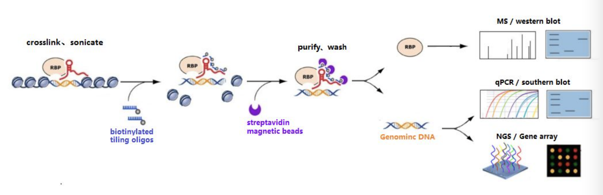
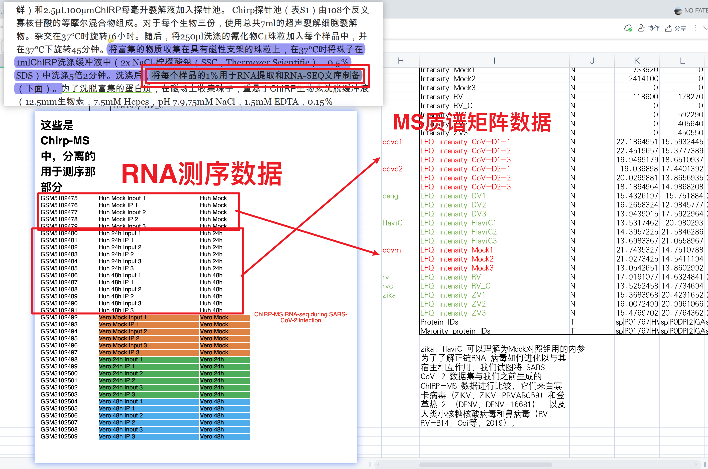

<!--
  * Author: Chen Jun
  * Author Email: 1170101471@qq.com
  * Created Date: 2021-08-03, 15:17:58
  * Modified By: Chen Jun
  * Last Modified: 2021-08-03, 15:21:08
-->

# sarscov2_chirp_ms

原理思考：

参考： [CHIRP-seq / RAP-seq ——ABlife](http://www.360doc.com/content/19/0923/09/52645714_862673515.shtml)

---
分组信息思考：

阅读笔记：
- [PDF](Discovery%20and%20functional%20interrogation%20of%20SARS-CoV-2%20RNA-host%20protein%20interactions%20-%20ScienceDirect.pdf)

表格汇总：
- [groups.xlsx](groups.xlsx)
- [meta_all.xlsx](meta_all.xlsx)

